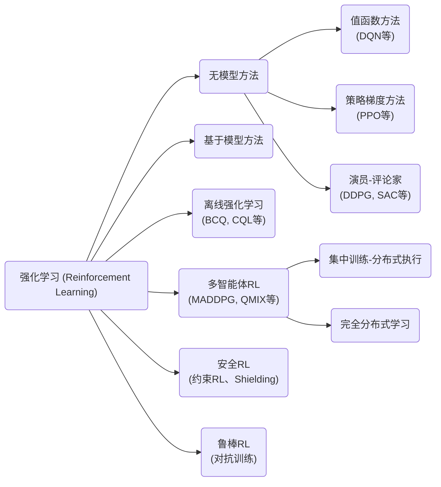

# 强化学习在计算机控制系统中的应用综述

## 执行摘要  
强化学习（RL）通过让智能体与环境交互以最大化累积奖励，构建了马尔科夫决策过程（MDP）模型。RL算法可分为**表格型**（如Monte Carlo、TD、Q-learning、Sarsa）、**值函数近似型**（如DQN、Double DQN、Rainbow等）和**策略梯度型**（如TRPO、PPO、SAC、DDPG、TD3、A3C等）。针对计算机控制系统中的不同场景（实时控制、分布式控制、嵌入式、网络控制等），应采用相应的RL框架和算法分类，如值函数方法、策略方法、模型基础/无模型、离线/在线、分布式/多智能体、安全/鲁棒RL等。应用时需关注样本效率、稳定性/收敛性和可验证性等指标。代表性方法在公开数据集或仿真平台（如OpenAI Gym、MuJoCo、SafeRL-Kit、D4RL等）上的性能可通过累计奖励、成功率、约束满足度等评估。当前主要挑战包括安全性、鲁棒性、稳定性难以保证、样本效率低、可解释性差等。未来可探索：结合控制理论的安全保障RL、多智能体分布式RL、离线与迁移RL提升样本效率、可验证的鲁棒RL策略等。建议投稿期刊/会议如《控制与决策》、《自动化学报》、IEEE Trans. on Neural Networks and Learning Systems、NeurIPS、ICRA等。

## 强化学习基础与算法分类  
强化学习旨在智能体通过与环境交互学习最优决策策略。环境通常建模为马尔科夫决策过程（MDP），由五元组$(S,A,T,R,\gamma)$描述：$S$为状态集，$A$为动作集，$T(s,a,s')$为转移概率，$R(s,a,s')$为即时奖励，$\gamma$为折扣因子。智能体在时刻$t$观察状态$s_t$，选取动作$a_t$，环境转移至$s_{t+1}$并反馈奖励$r_{t+1}$，目标是学习策略$\pi(a|s)$使长期累积奖励最大化。RL的核心思想是通过试错（探索-利用）机制优化策略。常见的**状态值函数**和**动作值函数**定义为：  
- 状态价值$V^\pi(s)=\mathbb{E}[\sum_{t=0}^\infty\gamma^t r_{t+1}\mid s_0=s]$；  
- 状态-动作价值$Q^\pi(s,a)=\mathbb{E}[\sum_{t=0}^\infty\gamma^t r_{t+1}\mid s_0=s,a_0=a]$。  

为了在大规模或连续空间中近似价值函数，出现了深度神经网络等函数逼近方法。RL算法可粗略分类为：  
- **表格型RL**：适用于小规模离散任务，如Monte Carlo、时序差分（TD）算法、Sarsa、Q-learning。以**Sarsa**和**Q-learning**为代表，其中Sarsa为同策略TD算法，Q-learning为离策略TD算法。  
- **值函数近似（Value-based）**：使用深度网络逼近Q值，代表算法有DQN及其改进版本（Double DQN、Dueling DQN、Rainbow等）。DQN通过经验回放和目标网络稳定训练过程。  
- **策略梯度（Policy-based）**：直接参数化策略并优化，代表算法有TRPO、PPO、DDPG、SAC、TD3等。PPO通过近端优化提高稳定性，SAC引入最大熵增强探索。  
- **演员-评论家（Actor-Critic）**：结合值函数和策略梯度，如A3C、DDPG、TD3、SAC等。这类方法兼具稳定性和样本效率。  
- **模型基础RL**：学习或利用环境模型进行规划，如PILCO（GP建模）、MBPO（模型预测）等，可大幅提高样本效率。  
- **离线RL**：在静态数据上学习最优策略，如BCQ、CQL等，适用于数据稀缺或真实系统学习成本高的场景。  
- **多智能体RL（MARL）**：针对含多个学习体（agent）的系统，扩展MDP为多智能体MDP（MAMDP），任务可分为完全合作、完全竞争、混合型。算法上可采用集中式训练—分布式执行（CTDE）框架或完全分布式学习，常见方法见表2。  

## 强化学习在计算机控制系统中的应用  
强化学习在计算机控制系统（包括实时控制、分布式控制、嵌入式控制、网络控制系统等）中被广泛探索。典型应用场景包括：机器人运动与路径规划、智能交通与车辆控制、能源系统调度（智能电网、微网）、航空航天控制、过程工业控制等。RL相对传统控制方法的优势在于无需精确系统模型即可通过试验优化策略，但同时面临样本效率低和稳定性难以保证的问题。  

常见做法是将经典控制目标转化为RL任务，并选择合适的算法和学习框架：  
- **实时控制**：场景如机械臂、高速飞行器，需要低延迟决策。通常使用快速收敛算法（如PPO、SAC）配合简化模型或模型预测方法，以适应有限的计算资源。延迟系统可通过**状态增强**（将历史观测加入状态）或**递归网络**等方法恢复马尔科夫性。  
- **分布式/网络控制**：节点之间通过网络通信时延或丢包会破坏MDP假设，此时可以采用多智能体RL（MARL）或延迟感知方法。多智能体控制任务（如车队协同、功率网络调度）常在CTDE框架下实现，例如MADDPG、MAPPO、QMIX等。这种模式下每个智能体仅使用自身观测（或邻居信息），通过共享经验进行集中训练，提高协作效率。  
- **嵌入式系统**：受计算资源和内存限制，需要轻量化策略。如利用模型剪枝、蒸馏或学习小型网络，并在仿真平台上评估（如Gazebo、Verilator）。同时考察学习算法的实时性和收敛速度。  

综合来看，RL方法在控制系统中的适用性取决于：**场景匹配**（离散 vs 连续、单机 vs 多机、线性 vs 非线性）和**性能要求**（精度、安全性、实时性等）。例如：值函数方法（如DQN及变种）适用于离散动作空间的任务；策略梯度方法（PPO/SAC）更适合连续控制；模型基础RL在样本成本高的机器人任务中可显著提高效率；多智能体算法则用于分布式控制和协调调度。同时，为了增强稳定性和安全性，研究者也引入了安全RL和鲁棒RL技术：安全RL采用约束优化、屏障函数（CBF）等手段确保训练和部署过程中的安全约束；鲁棒RL则引入对抗性训练（如RARL、RAP）以增强策略对扰动的鲁棒性。

## 实验设置与评价指标  
在控制系统中评估RL方法的实验设置通常包括：选择合适的仿真平台或数据集（如OpenAI Gym经典控制、MuJoCo物理引擎、SafeRL-Kit的安全驾驶环境、D4RL的离线数据集等），设计控制任务（轨迹跟踪、稳定性维持、优化调度等），并确定评价指标。常用评价指标包括：

- **累积奖励/回报**：衡量策略性能的核心指标。  
- **任务成功率/跟踪误差**：在轨迹跟踪、抓取等任务中关注误差或成功概率。  
- **样本效率**：完成学习所需的交互步数或训练时间。  
- **稳定性/鲁棒性**：策略对系统参数变化或环境扰动的敏感性；可用在干扰测试集上的性能跌幅来衡量。  
- **安全约束满足度**：在安全RL中，统计违反约束的次数或程度。  
- **收敛性**：学习曲线是否平稳收敛，以及最终策略的收敛性保障（常缺乏严格理论证明）。  
- **可解释性/可验证性**：尽管难以量化，但需要评估模型的透明度（例如是否可通过Lyapunov函数等方法证明闭环稳定性）。

对比实验通常使用相同的种子和环境设置，固定超参数或使用均值/方差来报告结果，以提高可重复性。公开基准平台包括SafeRL-Kit（自动驾驶安全）、D4RL（离线控制数据集）等，可确保不同方法的公平比较。

## 代表性方法比较  

| 方法         | 关键思想                                   | 控制任务示例                  | 样本效率       | 稳定性/鲁棒性       | 可验证性       | 平台/数据集                | 代表论文与代码示例                       |
| ------------ | ----------------------------------------- | ---------------------------- | -------------- | ------------------ | -------------- | -------------------------- | ---------------------------------------- |
| DQN  | 基于Q-learning的离策略深度值函数方法；使用经验回放和目标网络稳定训练 | 离散控制（CartPole、Atari） | 中等（需大量样本） | 训练可能不稳定     | 较低（难以解析） | OpenAI Gym、Atari       | Mnih *et al.*, Nature2015; [PyTorch代码](https://github.com/torch/rl) |
| PPO  | 近端策略优化，采用KL约束或裁剪目标保证更新稳定 | 连续控制（机械臂、自动驾驶） | 较高（样本利用率较好） | 相对稳定           | 中等（无严格证明） | MuJoCo、SafeRL-Kit      | Schulman *et al.*, ICML2017; [OpenAI Baselines](https://github.com/openai/baselines) |
| SAC  | 最大熵策略梯度，兼顾探索与利用；无模型、离策略 | 连续控制（HalfCheetah、Autonomous Driving） | 高（更快收敛）   | 高（鲁棒性好）    | 中等（缺乏解析界） | MuJoCo、SafetyGym     | Haarnoja *et al.*, ICML2018; [Spinning Up](https://github.com/openai/spinningup) |
| CQL（保守Q学习） | 离线强化学习方法，通过惩罚过估计减小分布偏移 | 机器人离线数据、无人驾驶场景   | 高（利用离线数据） | 鲁棒性较好（保守策略） | 低（理论分析复杂） | D4RL数据集   | Kumar *et al.*, NeurIPS2020; [代码](https://github.com/aviralkumar2907/CQL) |
| QMIX  | 分解全局值函数为局部值函数（值分解网络）；集中训练分散执行 | 协作型任务（资源调度、团队游戏） | 中等             | 中等（依赖设计）     | 中等            | StarCraft-Micro（SMAC）、MADDPG基准 | Rashid *et al.*, ICML2018; [公开实现](https://github.com/oxwhirl/qmix) |
| 安全RL（CPO等） | 引入约束优化（如拉格朗日因子、安全层、屏障函数等）确保策略满足安全约束 | 自动驾驶避障、安全工业控制 | 低（额外约束导致学习慢） | 增强（遵守约束）   | 较高（可分析约束） | SafetyGym、SafeRL-Kit | Achiam *et al.*, ICML2017; [SafeRL-Kit](https://github.com/zlr20/saferl_kit) |

*表格说明：样本效率、稳定性等评估依赖任务与设置而变化；可验证性指方法提供的理论证明程度。以上方法仅代表各类典型，实际应用时需结合具体场景调参。*

## 未来研究方向与建议  
1. **安全与稳定的强化学习控制**：研究结合控制理论（如Lyapunov函数、控制障碍函数等）的安全RL框架，以严格保证实时控制中的闭环稳定性和约束满足。可在自动驾驶或智能电网等安全关键任务中测试，对比加入安全层前后的碰撞率、违例率和任务完成率。评价指标包括安全约束违例次数、学习收敛时间、性能损失等。难点在于设计可扩展的安全准则及高效优化算法。  
2. **样本高效的模型基础与离线RL**：结合物理模型或先验知识提升样本效率。例如在机械臂或无人机控制中，利用已有动力学模型进行PILCO/MBPO优化，并与离线RL（如NeoRL、D4RL）结合，以在真实环境有限数据下学习。验证可用SIMULINK或Gazebo仿真平台，比较纯模型方法、纯RL和混合方法的学习曲线和最终性能。指标为训练步数、最终回报和鲁棒性。预期难点在于模型误差处理与算法稳定性。  
3. **分布式与多智能体RL控制**：探索在大规模分布式控制中应用MARL和联邦RL技术，如智能电网节点协同调度、车队协同驾驶。可使用CTDE框架实施（如MADDPG、MAPPO、HATRPO等）并与分布式优化方法结合；部署在多智能体仿真平台（如MATPOWER网格仿真、SUMO交通仿真）测试。评估指标包括系统稳定性（频率偏差等）、通信开销、收敛速度。挑战包括多智能体非平稳性和通信延迟问题。  
4. **鲁棒性与不确定性处理**：研究对抗训练、域随机化等方法提高控制策略对环境扰动的鲁棒性。在多种干扰（噪声、模型变化）下验证，如四旋翼飞行器在风扰动下的跟踪误差。评估稳定性（轨迹偏差统计）、收敛性（训练损失）和安全性（未偏离工作区的概率）。难点在于平衡鲁棒性与性能损失。可尝试结合健壮控制理论（H∞、$L_1$增益等）进行策略设计。  
5. **可解释性与可验证性强化学习**：开发支持策略验证的学习算法，如通过结构化策略（行为树、基于模式的控制）或使用控制可证明的网络架构。实验可设置为对比常规深度策略和可解释策略在跟踪任务中的性能与验证难度。评估指标包括策略简洁性、验证所需时间/条件、实际性能。利用验证工具（如SMT求解器）进行闭环分析。难点在于在复杂控制问题中兼顾性能与可解析性。  
6. **实时与嵌入式RL**：针对资源受限的嵌入式系统，将RL算法优化为低延迟、低内存版本，如网络结构压缩、在线学习的增量更新算法。可在微控制器或FPGA平台上部署（任务示例：无人机姿态控制），评测指标为控制周期延迟、能耗、策略精度。预见的挑战包括需要权衡模型复杂度与控制精度。  
7. **标准化基准与评测**：建立适用于控制系统的统一基准和数据集，例如面向工业过程控制的仿真环境（代替OpenAI Gym）、带延时/不确定性的网络控制基准，以便公平比较算法。建议采用如SafeRL-Kit、D4RL等平台，结合控制领域经典任务（倒立摆、无人机航迹规划、功率系统调度），统一评价方法。

## 投稿建议  
该综述适合提交控制与人工智能交叉领域期刊或会议。**国内**可考虑《中国控制会议(CCDC)》、《自动化学报》、《控制与决策》等。**国际**可考虑IEEE TNNLS、IEEE T-Cybernetics、ICRA、NeurIPS、ICML等期刊与会议。投稿时应突出本文系统性（覆盖模型基础/无模型、在线/离线、多智能体、安全/鲁棒等多个维度）及对未来挑战的深度剖析，并针对目标期刊领域强调应用实例，如工业或航空航天控制案例。合适的投稿要点包括强调综述的全面性、关键进展和未来研究路线的具体性。  

**参考文献：**本文引用了近年来强化学习与控制领域的重要综述和原始文献，包括RL算法基础与分类、安全和鲁棒强化学习综述、多智能体强化学习分类、以及针对时滞系统的最新综述等。这些参考文献提供了算法定义、应用示例和研究挑战的依据。